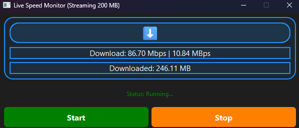
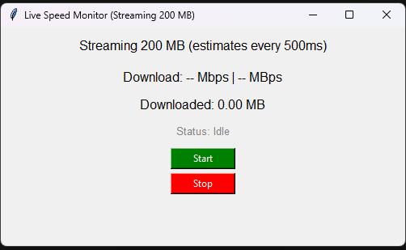

# Internet Speed Monitor

A real-time internet speed monitor with a graphical interface, available in both **Tkinter** and **PyQt6** versions. Instantly see your download (and upload, in PyQt) speeds, total data transferred, and status updates in a modern, user-friendly window.

---

## Features

| Feature                | Tkinter Version (`active_speed_monitor.py`) | PyQt6 Version (`active_speed_monitor_pyqt.py`) |
|------------------------|:------------------------------------------:|:----------------------------------------------:|
| Download Speed         | ✅                                          | ✅                                              |
| Upload Speed           | ❌                                          | ✅                                              |
| Real-Time Updates      | ✅ (every 0.5s)                             | ✅ (every 0.5s)                                 |
| Total Data Counter     | ✅                                          | ✅                                              |
| Start/Stop Controls    | ✅                                          | ✅                                              |
| Threaded/Async         | ✅ (threaded)                               | ✅ (QThread)                                    |
| Modern UI/Animations   | ❌                                          | ✅ (glow, fade, icons)                          |
| Status Display         | ✅                                          | ✅                                              |
| Error Handling         | ✅                                          | ✅                                              |
| Cross-Platform         | ✅                                          | ✅                                              |

---

## Screenshots

**PyQt6 Version:**



**Tkinter Version:**



---

## How It Works

- **Download Test:** Both versions download a 200 MB test file from Cloudflare in chunks, measuring speed in real time.
- **Upload Test (PyQt only):** The PyQt version can also test upload speed by sending random data to a local server.
- **Live GUI:** See your current speed (Mbps/MBps), total MB transferred, and status (Idle, Downloading, Completed, Stopped, Error).
- **Start/Stop:** Begin or halt the test at any time. The UI remains responsive throughout.

---

## Requirements

- **Python 3.x**
- **requests** library (`pip install requests`)
- **PyQt6** (`pip install PyQt6`) — *for the PyQt version only*

---

## Usage

### Tkinter Version

1. **Install dependencies:**
   ```bash
   pip install requests
   ```
2. **Run:**
   ```bash
   python active_speed_monitor.py
   ```
3. Click **Start** to begin the download speed test. Click **Stop** to halt and reset.

---

### PyQt6 Version

1. **Install dependencies:**
   ```bash
   pip install requests PyQt6
   ```
2. **Run:**
   ```bash
   python active_speed_monitor_pyqt.py
   ```
3. Click **Start** to begin both download and upload speed tests. Click **Stop** to halt and reset.

> **Note:** For upload speed testing, the PyQt version starts a local HTTP server if run with `--server`. For most users, just run without arguments for the GUI.

---

## File Overview

- `active_speed_monitor.py` — Tkinter-based, download speed only, simple UI.
- `active_speed_monitor_pyqt.py` — PyQt6-based, download & upload speed, modern UI with animations.
- `Speed Monitor PyQt.exe` / `Speed Monitor Tkinter.exe` — Pre-built executables (if provided).
- `net works.txt` — Development notes.
- `active_speed_monitor.spec` — PyInstaller spec for building executables.

---

## Limitations

- **Data Usage:** Each test downloads (and uploads, PyQt) up to 200 MB.
- **Speed Variability:** Results depend on your ISP, network, and server conditions.
- **Upload Test (PyQt):** Uploads to a local server, not a real internet endpoint.

---

## Author

Created by FAiTH 