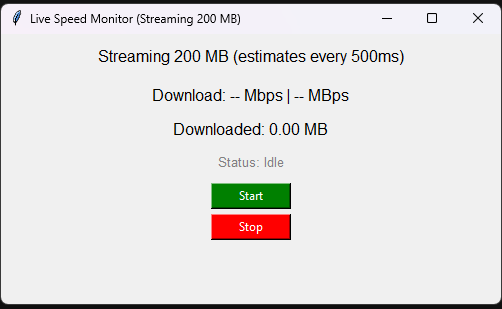
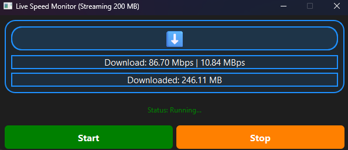

# Live Speed Monitor

A lightweight desktop app to monitor real‑time internet download speed by continuously streaming a test file and updating estimates roughly every 500 ms. Two GUI implementations are included:

- PyQt6 (animated, modern UI)
- Tkinter (minimal, cross‑platform)

Both versions stream from Cloudflare’s public speed endpoint and show:
- Current download rate in Mbps and MBps
- Total data downloaded
- Start/Stop controls and live status


## Screenshots

Tkinter UI



PyQt6 UI




## How it works

The app streams a 200 MB payload from Cloudflare’s speed test endpoint and measures throughput over short intervals:

- Test URL: https://speed.cloudflare.com/__down?bytes=200000000
- Mbps = (bits_downloaded_since_start / elapsed_seconds) / 1,000,000
- MBps = Mbps / 8

Notes:
- Shorter measurement windows make the UI more responsive but less smooth.
- Throughput varies with ISP shaping, local congestion, and route to the test host.

## Features

- Real‑time speed updates every ~0.5s
- Continuous streaming for stable rolling estimates
- Total downloaded counter
- Start/Stop without restarting the app
- PyQt6 build:
  - Rounded card with glow animation on the download icon
  - Smooth window fade‑in/out
  - Background worker thread with signal/slot updates and graceful shutdown
- Tkinter build:
  - Simple, portable UI
  - Background thread for non‑blocking updates

## Requirements

- Python 3.9+
- requests

For PyQt6 build:
- PyQt6

Tkinter is included with most Python installations.

## Installation

```bash
# Clone
git clone .git
cd 

# Create & activate a virtual environment (recommended)
python -m venv .venv
# Windows
.venv\Scripts\activate
# macOS/Linux
source .venv/bin/activate

# Install dependencies
pip install -r requirements.txt
```

Example requirements.txt:
```
requests
PyQt6 ; extra == "pyqt"
```

Or install directly:
```
pip install requests PyQt6
```

## Run

Tkinter app:
```bash
python active_speed_monitor.py
```

PyQt6 app:
```bash
python active_speed_monitor_pyqt.py
```

## Project structure

- active_speed_monitor.py — Tkinter implementation
- active_speed_monitor_pyqt.py — PyQt6 implementation with animations and QThread worker
- screenshots/
  - tkinter_screenshot.jpg
  - pyqt_screenshot.jpg
- README.md

## Architecture notes

PyQt6:
- DownloadWorker (QThread)
  - Streams with requests, computes Mbps every ~500 ms
  - Emits progress(mbps, mbps_byte, downloaded_mb), error(str), finished()
  - Graceful stop via running flag and wait()
- RealTimeSpeedMonitorPyQt (QWidget)
  - Starts/stops worker, updates labels via signals
  - Glow animation via QGraphicsDropShadowEffect
  - Window fade via QPropertyAnimation

Tkinter:
- Background Thread streams and updates labels using thread‑safe widget config calls.
- Simple start/stop state handling and cumulative byte counter.

## Customization

- Change test size: edit TEST_URL bytes parameter.
- Adjust update cadence: tweak the 0.5‑second check in the worker loop.
- Tune chunk size:
  - Tkinter: CHUNK_SIZE
  - PyQt6: CHUNK_SIZE_DOWNLOAD

## Troubleshooting

- “Network error” or no updates
  - Verify internet connection and firewall permissions.
  - Some networks may block or throttle the test endpoint.
- UI freezes
  - Ensure only one worker is running. The PyQt6 version guards and waits on stop.
- Speed lower than browser tests
  - Browser tools often use multiple connections and longer averaging windows.

## Safety and data usage

- This tool downloads data continuously; avoid on metered connections.
- No uploads or personal data collection.
- For indicative measurements only; not a certified speed test.

## Contributing

Issues and PRs are welcome. For bug reports, include:
- OS and Python version
- Steps to reproduce
- Console output and screenshots if relevant

## License

MIT License. See LICENSE for details.
